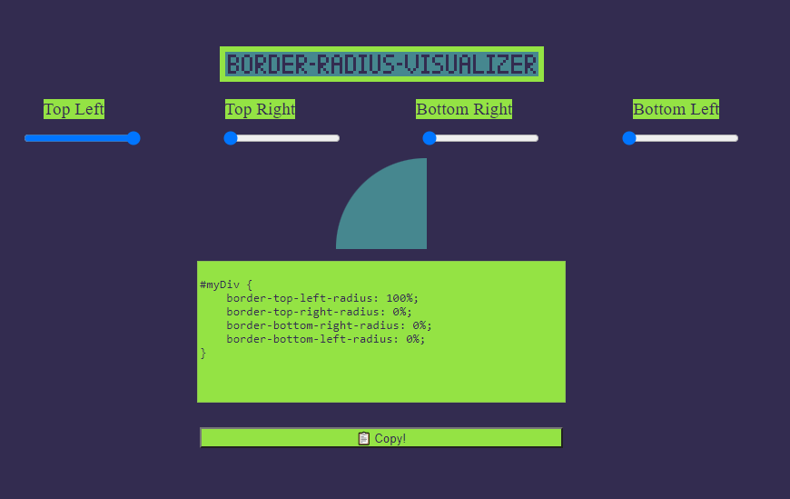

# border-radius Visualizer

## Overview

Adjust CSS border-radius using sliders and live visualization and copy the resulting code.

#### Live at: https://sanskar-mk2.github.io/border-radius-visualizer/

## Features

-   Easily manipulate border-radius using sliders
-   Copy the resulting code to use in your project

## Example Screenshots

